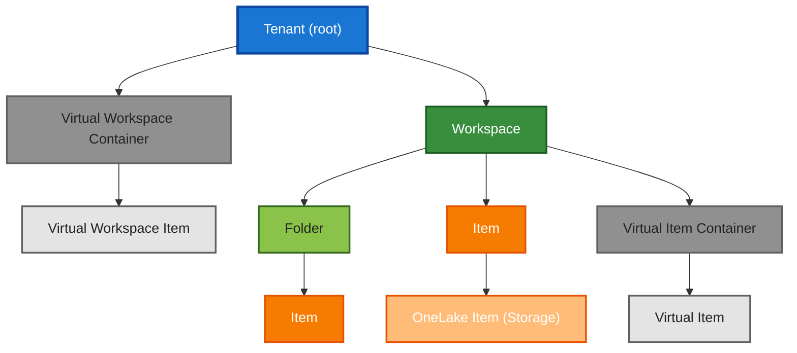

# Fabric CLI Hierarchy

The Fabric CLI uses a hierarchical structure to organize and manage resources. This structure helps in navigating and managing different components of Microsoft Fabric through the CLI.

## Hierarchy

The following diagram shows the hierarchical relationship between different elements in the Fabric CLI, including all major types: tenant, virtual workspaces, workspaces, folders, items, virtual items, virtual item containers, OneLake items, and their relationships.




The hierarchy defines how paths work in the CLI.
### Examples

```
# Workspace level
/workspace1.Workspace

# Item in workspace
/workspace1.Workspace/item1.Lakehouse

# Folder in workspace
/workspace1.Workspace/folderA.Folder

# Nested folder and item
/workspace1.Workspace/folderA.Folder/folderB.Folder/item2.Notebook

# OneLake item (file)
/workspace1.Workspace/item1.Lakehouse/Files/data.csv

# Virtual workspace item (capacity)
/.capacities/cap1.Capacity

# Virtual item container and virtual item
/workspace1.Workspace/.sparkpools/spark1.SparkPool
```

## Element Types

### Tenant (Root)
The tenant represents the root level in the CLI hierarchy, similar to the root directory (`/`) in a command line interface. Just as all files and directories in a filesystem exist under the root directory, all Fabric resources exist under a tenant.

A tenant can contain:

- Workspaces (like user directories)
- Virtual Workspaces (like system directories)

The tenant level is implicit in paths, just as the root directory is often implicit in filesystem paths. For example:

```
# Tenant is implicit, like root directory in these paths
/workspace1.workspace      # Similar to /home in Linux
/workspace1.workspace/item # Similar to /home/file in Linux
```

### Fabric Elements

These are the standard elements that users interact with for creating, managing, and organizing their Fabric resources.

#### Workspaces

Workspaces are the primary containers for Fabric items and folders. They function like user directories in a file system.


##### Example
```
/Sales Analytics.Workspace
```

#### Folders

Folders organize items within a workspace and can be nested.

##### Example
```
/Sales Analytics.Workspace/Sales Rep.Folder
```

#### Items

**Items** are the actual Fabric resources that contain your work - datasets, reports, notebooks, etc.

##### Examples

```py
# Lakehouse path example
/Sales Analytics.Workspace/customerdata.Lakehouse

# Report path example
/Marketing Dashboard.Workspace/Campaign Performance.Report

# Notebook path example
/Finance Reports.Workspace/budgetforecast.Notebook
```

#### OneLake Items

**OneLake items** represent the storage layer within certain Fabric items, providing file-system-like access to data.

##### Examples

```py
# File path example
/Sales Analytics.Workspace/customerdata.Lakehouse/Files/raw-data.csv

# Nested directories example
/Marketing Dashboard.Workspace/campaigndata.Lakehouse/Files/uploads/2024

# Table path example
/Sales Analytics.Workspace/customerdata.Lakehouse/Tables/customer_profiles
```

### Virtual Fabric Elements

Virtual Fabric Elements represent a fundamentally different category from standard Fabric elements. Unlike Fabric elements (workspaces, items), Virtual Fabric Elements act as abstraction layers over underlying Microsoft Fabric, presenting them through a unified CLI hierarchy for consistent management and automation.

#### Virtual Workspace Containers
Virtual workspace Container are tenant-level containers that organize and manage infrastructure entities. These are not workspace settings containers, but rather administrative boundaries that group related system entities for management purposes.

These virtual workspaces provide centralized control over infrastructure that supports multiple regular workspaces within the tenant.

!!! info "Supported Virtual Workspace Containers"
    - `.capacities` (Tenant-wide resource allocation)
    - `.connections` (Shared data source connectivity)
    - `.domains` (Governance and security boundaries)
    - `.gateways` (Hybrid data connectivity infrastructure)

#### Virtual Workspace Items
Virtual workspace items are system entities under a virtual workspace (e.g., a specific capacity or gateway).

!!! info "Supported Virtual Workspace Item Types"
    - `.Capacity`
    - `.Connection`
    - `.Domain`
    - `.Gateway`

#### Virtual Item Containers
**Virtual item containers** are workspace-scoped containers for infrastructure entities.

!!! info "Supported Virtual Item Containers"
    - `.sparkpools` (Dedicated compute resources)
    - `.managedidentities` (Service authentication)
    - `.managedprivateendpoints` (Private network access)
    - `.externaldatashares` (Cross-tenant data sharing)

#### Virtual Items

Virtual items are workspace-scoped infrastructure entities that exist within the context of a specific workspace. Unlike regular items, they are not visible as standalone resources in a workspace view of the Fabric portal.

These virtual items enable secure, managed infrastructure within individual workspaces while maintaining isolation and proper access control.

!!! info "Supported Virtual Item Types"
    - `.ExternalDataShare`
    - `.ManagedIdentity`
    - `.ManagedPrivateEndpoint`
    - `.SparkPool`
